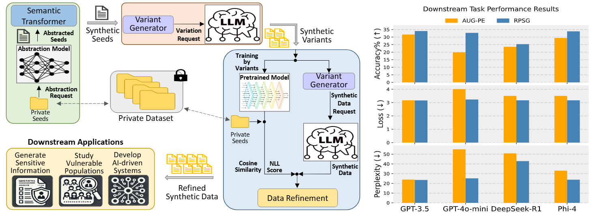

<h1 align="center"> Private Seeds, Public LLMs: Realistic and Privacy-Preserving 
  
  Synthetic Data Generation</h1>

In this work, we presented RPSG, a realistic and privacy-preserving synthetic data generation method. Empirical results demonstrate that RPSG consistently outperforms SOTA baselines in generating high-quality synthetic data, achieving strong utility while safeguarding privacy. 
<p align="center">
  
</p>


## Setup
### Environment setup

```
conda env create -f rpsg.yml
conda activate rpsg
```

### Data Preparation

Datasets are located at  `data/{dataset}` where `dataset` is `sd` and `pubmed`.

Download PubMed `train.csv` by executing:
```bash 
bash scripts/download_data.sh
```
Dataset description: 
- SD: We collected real-world SD content from Reddit to target posts authored by LSE populations. We first selected subreddits associated with financial hardship and poverty, and applied a keyword-based filtering strategy designed to capture language related to economic challenges. We collected posts published between January 1, 2024, and March 31, 2025, ensuring that the majority of data falls after the training cutoffs of both GPT-4 (October 2023) and Phi-4 (June 2024). This timing minimizes the likelihood that these LLMs were exposed to our dataset during training, supporting its value for evaluating model generalization and privacy behavior. The final dataset consists of 8,948, 1,000, and 1,000 posts in the training, validation, and test sets, respectively. All posts were publicly available and collected in accordance with Reddit’s terms of service.
- PubMed: Abstracts of medical papers in [PubMed](https://www.ncbi.nlm.nih.gov/) from 2023/08/01 to 2023/08/07 crawled by [(Yu et al. 2023)](https://openreview.net/forum?id=FKwtKzglFb), with 75316 abstracts for training, 14423 for validation, and 4453 for testng.


### Generating Private Data Embeddings

Pre-compute embeddings for private data :
```bash  
bash scripts/embeddings.sh --sd  
bash scripts/embeddings.sh --pubmed       
```


## Run Scripts
### Each end-to-end script consists of data generation, filtering, performance evaluation, and PII detection.

```bash 
bash scripts/{LLMs}/*.sh
# Replace `{LLMs}` with the names of LLMs. For example:
# bash scripts/gpt-4o-mini/sd_g4o.sh leverages the gpt-4o-mini and the sd dataset
# bash scripts/hf/pubmed/rpsg-pubmed_phi4.sh leverages the phi-4 and the pubmed dataset
```

### Azure API
We use Azure API to access closed-source LLMs, please get your api key via [Azure](https://learn.microsoft.com/en-us/azure/ai-services/openai/quickstart?tabs=command-line,python&pivots=programming-language-python)
```python
DeepSeek_CONFIG={
        'DeepSeek-R1':{ "openai_api_key":  "YOUR_AZURE_OPENAI_API_KEY",
                        "openai_api_base": "YOUR_AZURE_OPENAI_ENDPOINT",
                        "engine": 'DeepSeek-R1',
                      },
    }
```

## Acknowledgement

- [AUG-PE](https://github.com/AI-secure/aug-pe)

